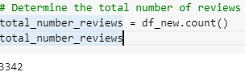
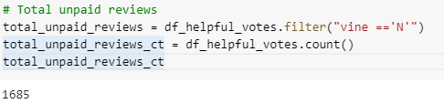
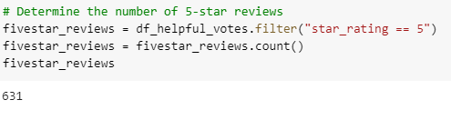
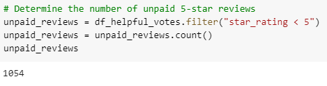
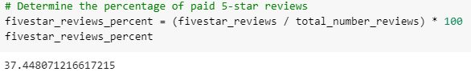
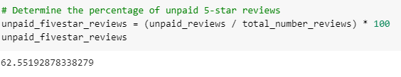

# Amazon_Vine_Analysis

## Overview of Project

### Purpose
The purpose of this project is to analyze Amazon reviews written by members of the paid Amazon Vine program.

## Results
From this analysis, we can address the following questions:
     * There are 3342 total number of reviews and 1685 unpaid reviews.
     
     
     * There are 631 5-star reviews and 1054 non-Vine reviews. 
     
     
     * The percentage for paid 5-star reviews is 37% and 62% for unpaid 5-star reviews.
     
     
     
      
## Summary
Based on the analysis, there doesn't seem like it was any positivity bias for reviews in the Vine program because the data shows that percentage of the unpaid 5-star reviews were higher than the paid 5-star reviews.

An additional analysis that I would recommend is to separate the data into training and testing sets in order to evaluate the dataset. By doing this, you can minimize the effects of data discrepancies and better understand the characteristics of the model.
